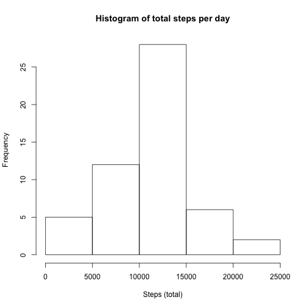

## Loading and preprocessing the data

```r
library(ggplot2)
library(data.table)

## Load the data
activities <- read.csv(unz('activity.zip', 'activity.csv'))

activities.dt <- data.table(activities)
activities.dt.grpd <- activities.dt[,sum(steps), by=date]
```

## What is mean total number of steps taken per day?


```r
activities.dt.grpd.mean <- mean(activities.dt.grpd$V1, na.rm=TRUE)
activities.dt.grpd.median <- median(activities.dt.grpd$V1, na.rm=TRUE)

hist(activities.dt.grpd$V1, main="Histogram of total steps per day", xlab="Steps (total)")
```

 

The mean number of steps taken per day is 10766.
The median number of steps taken per day is 10765.

## What is the average daily activity pattern?


```r
activities.dt.grpd.interval <- activities.dt[,mean(steps, na.rm=TRUE), by=interval]
plot(activities.dt.grpd.interval$V1, type="l", main="Average Daily Activity Pattern", xlab="Steps (average)", ylab="")
```

 

```r
maxRow <- activities.dt.grpd.interval[which.max(activities.dt.grpd.interval$V1),]
```

The 5-minute interval, on average across all the days in the dateset, that contains the maximum number of steps is 835.

## Imputing missing values


```r
## Total number of NA's in the original dataset
totalNAs <- sum(is.na(activities$steps))
```

The total number of missing values in the dataset is 2304


```r
activities.merged <- merge(activities, activities.dt.grpd.interval, by.x=3, by.y=1, all.x=TRUE)
activities.merged.sorted <- activities.merged[with(activities.merged, order(date, interval)),]

na.steps <- which(is.na(activities$steps))
na.steps.mean <- activities.merged.sorted$V1[na.steps]
activities.dt$steps[na.steps] <- na.steps.mean

activities.dt.updated.grpd <- activities.dt[,sum(steps), by=date]

activities.dt.updated.grpd.mean <- mean(activities.dt.updated.grpd$V1, na.rm=TRUE)
activities.dt.updated.grpd.median <- median(activities.dt.updated.grpd$V1, na.rm=TRUE)

hist(activities.dt.updated.grpd$V1, main="Histogram of total steps per day", xlab="Steps (total)")
```

 

The mean number of steps taken per day is 10766.
The median number of steps taken per day is 10766.

## Are there differences in activity patterns between weekdays and weekends?


```r
isWeekend <- function(x) {
    if(x == TRUE) {
        result <- 'weekend'
    } else {
        result <- 'weekday'
    }
    result
}
activities.dt$dayType <- lapply(grepl("Sat|Sun", weekdays(as.Date(activities$date))), isWeekend)
activities.dt$dayType <- as.character(activities.dt$dayType)
activities.dt$dayType <- as.factor(activities.dt$dayType)

activities.dt.grpd.day <- activities.dt[,mean(steps, na.rm=TRUE), by=list(interval,dayType)]

activities.dt.grpd.weekend <- subset(activities.dt.grpd.day, grepl('weekend', dayType))
activities.dt.grpd.weekday <- subset(activities.dt.grpd.day, grepl('weekday', dayType))

par(mfrow=c(2,1))
plot(activities.dt.grpd.weekday$V1, type="l", xlab="Weekday Steps (average)", ylab="")
plot(activities.dt.grpd.weekend$V1, type="l", xlab="Weekend Steps (average)", ylab="")
```

 
